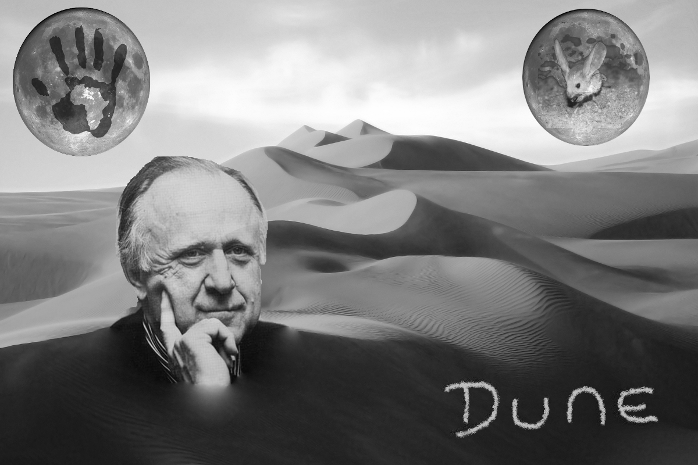

### Dune
Dune is a sci-fi series written in the 1960s by Frank Herbert.
The story took place thousands of years from now on a desert 
planet known as Dune. Melange is the ultimate resources because 
it is essential for space travel, and it can only be produced on 
Dune. The protagonist is Paul Atreides, who later became known 
as Paul Muaddib, or Messiah of Dune.
He has gained prescient vision through his early Bene Gesserit 
training and exposure to Melange on Dune. Because of his prescient 
sight, few events escaped his vision and none brings surprise. 
When he realized his destiny -- the golden path -- and the futility 
for anything different, he chose to deny his destiny and walked 
into the Fremen desert. His son Leto, on the other hand, had similar
abilities and accepted the golden path by physically transforming
into a sandworm, who can live for millinnium. He became the God 
Emperor, and the constant of universe. Throughout the thousands of years 
that he had lived, he had witnessed the change in the landscape of 
universe. Through him, globalization of the universe happened.

In the picture, we can see Dune's 2 moons. It was said that one of
them had a human hand print, while the other had a little desert 
creature -- Muaddib. In the middle, we can see the author, Frank 
Herbert, contemplating about his desert story -- Dune.

### Installation
This picture fits perfectly in a bookstore or library (next to the
Dune series preferably).

### Sources:

* Frank Herbert
* desert
* hand
* kagaroo mouse
* the moon
* Dune novel

